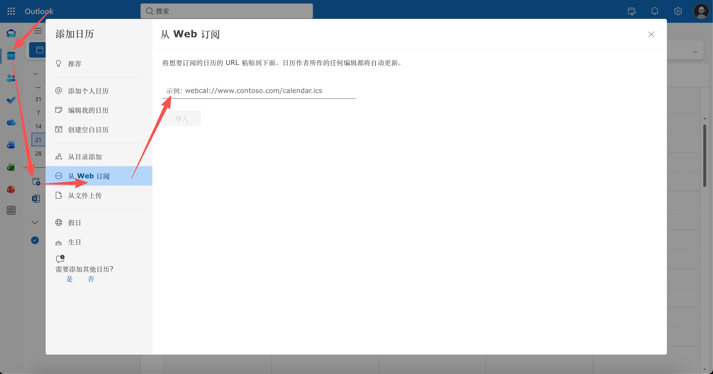
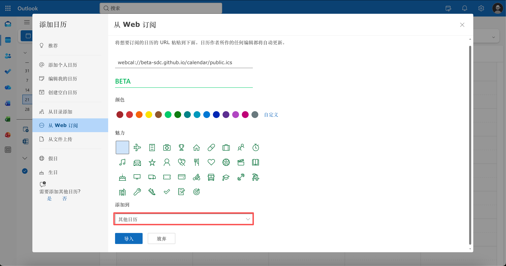

# 在 Outlook 中订阅 BETA-SDC 日历

## 使用 Web 订阅地址，自动获取日历更新

通过 Outlook 的 **从 Web 订阅** 功能添加日历，后续活动更新会由
Outlook 自动同步。

---

## 开始前

1. 打开 [BETA-SDC 日历订阅页面](https://beta-sdc.github.io/calendar/)。
2. 选择需要订阅的分类、年份和月份。
3. 点击 **复制订阅地址**。
4. 按照本教程在 Outlook 中添加日历。

> 不要使用“下载 ICS”后再导入。
>
> 下载是一次性文件；通过网址订阅才能自动获取后续更新。

订阅地址可以是页面复制出的 HTTPS 地址，也可以使用对应的
`webcal://` 地址。

---

## Outlook 网页版

### 1. 打开日历

登录 [Outlook 网页版](https://outlook.live.com/calendar/)，进入 **日历**。

在左侧选择 **添加日历**。

---

## Outlook 网页版

### 2. 选择“从 Web 订阅”

在“添加日历”面板中选择 **从 Web 订阅**。

部分版本可能显示为：

- **从 Internet 订阅**
- **订阅自 Web**
- **Subscribe from web**



---

## Outlook 网页版

### 3. 粘贴订阅地址

将刚才复制的订阅地址粘贴到网址输入框。

例如：

```text
webcal://beta-sdc.github.io/calendar/public.ics
```

然后填写日历名称和颜色。



---

## 关键选项：添加到“其他日历”

在 **添加到** 下拉选项中，必须选择：

**其他日历**

然后点击 **导入**。

> 请务必选择“其他日历”，不要把订阅内容当作个人日历事件导入。
>
> 只有以日历订阅的方式添加，Outlook 才能继续从订阅地址获取更新；
> 如果选择了其他导入方式，后续活动变化可能不会自动同步。


---

## 订阅成功后的表现

添加完成后，确认：

- 日历出现在左侧的 **其他日历** 分组中；
- 日历名称旁边显示已启用状态；
- 日历中能看到活动标题、时间和地点；
- 后续重新发布活动后，Outlook 可以继续同步更新。


---

## 订阅地址怎么选？

在 BETA-SDC 日历页面中，可以选择：

| 需求 | 推荐范围 |
| --- | --- |
| 只看公开活动 | 公开活动 |
| 只看内部会议 | 内部事件 |
| 查看全部活动 | 全部活动 |
| 只关注某一年 | 选择年份 |
| 只关注某个月 | 选择月份 |

选择范围后，再复制对应的订阅地址。

---

## 关于自动更新

- 订阅地址会持续提供同一个日历源。
- 日历应用会按照自己的同步策略检查更新。
- 本仓库的发布 workflow 每天自动运行一次。
- Outlook 的实际显示时间可能受到客户端同步周期影响。

如果刚刚修改过活动，请等待一段时间后再检查 Outlook。

---

## 常见问题

### 为什么不能直接双击下载的 ICS 文件？

可以打开，但这通常会变成一次性导入，之后源日历的修改不会自动同步。

需要长期跟随更新时，请使用 **从 Web 订阅**，并在 **添加到** 中选择
**其他日历**。

### 为什么看不到新活动？

请依次检查：

1. 订阅地址是否复制完整；
2. 选择的分类、年份和月份是否正确；
3. **添加到** 是否选择了 **其他日历**；
4. Outlook 是否已经完成同步；
5. 网络是否可以访问 `beta-sdc.github.io`；
6. 是否误用了下载文件，而不是订阅地址。

### 如何修改订阅范围？

在 BETA-SDC 日历页面重新选择范围，复制新的地址，然后在 Outlook 中新增订阅。

旧订阅可以在 Outlook 的日历列表中删除。

---

## 可选补充材料

相关截图放在：

```text
images/
```

相关 PDF 放在：

```text
pdf/
```

插入图片时可以使用相对路径：

```markdown

```

添加 PDF 时，可以提供下载链接：

```markdown
[下载 PDF 教程](pdf/outlook-subscription-guide.pdf)
```

---

## 教程待完善

这是一份 Marp 草稿。后续可以补充：

- 更多实际 Outlook 网页版截图；
- 不同语言界面的按钮名称；
- PDF 版教程；
- 具体的同步等待时间说明。
